# n8n on AKS - Postgres + Azure Key Vault secrets

Terraform provisions an AKS cluster (Cilium dataplane/network policy), a managed
Postgres Flexible Server, and an Azure Key Vault. n8n runs as a Deployment,
backed by Postgres, exposed via a LoadBalancer Service. DB credentials never
live in plain YAML - they flow through Key Vault and the Secrets Store CSI
Driver into a Kubernetes Secret at deploy time.

## Infra (Terraform)

```bash
cp .env.example .env   # fill in subscription ID + db user/password
make init
make plan
make apply
```

Outputs include `db_host`, `db_name`, `db_user`, `key_vault_name`,
`key_vault_uri`, and `kubectl_credentials_command` (run that one to
authenticate `kubectl`/`k9s` against the cluster).

## Secrets flow

How a value in `.env` ends up as an environment variable inside the n8n
container, without ever being written to a Kubernetes manifest in plaintext:

```mermaid
flowchart LR
    subgraph env_box[".env"]
        ENV["━━━━━━━━━━━━━━━━━━━━━━━━━━━<br/>TF_VAR_db_user=n8n-admin"]
    end

    subgraph tf_entry[Terraform]
        direction TB

        VAR["main.tf<br/>━━━━━━━━━━━━━━━━━━━━━━━━━━━<br/>variable db_user {<br/>&nbsp;&nbsp;type = string<br/>&nbsp;&nbsp;sensitive = true<br/>}"]
        PG["azurerm_postgresql_flexible_server<br/>administrator_login"]
        KVS["azurerm_key_vault_secret 'db-user'<br/>(lives in Azure Key Vault)"]
    end

    ENV --> VAR

    subgraph k8s[Kubernetes]
        direction TB

        SPC["secrets.yaml.tpl<br/>━━━━━━━━━━━━━━━━━━━━━━━━━━━<br/>apiVersion: secrets-store.csi.x-k8s.io/v1<br/>kind: SecretProviderClass<br/>metadata:<br/>&nbsp;&nbsp;name: n8n-secrets"]
        CSI["Secrets Store CSI Driver<br/>(DaemonSet, every AKS node)<br/>auths via AKS managed identity"]
        FILE["Volume mount:<br/>/mnt/secrets-store/db-user"]
        K8SSEC["secretObjects sync creates:<br/>Secret n8n-container-env"]
        ENVFROM["Pod envFrom.secretRef<br/>-> DB_POSTGRESDB_USER env var"]

        PG --> KVS --> SPC --> CSI
        CSI --> FILE
        CSI --> K8SSEC
        K8SSEC --> ENVFROM
        FILE -.->|"mounting the CSI volume is what<br/>triggers the fetch+sync at all"| K8SSEC
    end

    VAR --> PG

    FILE -.->|"mounting the CSI volume is what<br/>triggers the fetch+sync at all"| K8SSEC
```



Key things this diagram is making explicit:
- **Terraform never passes the secret to Kubernetes directly.** It creates the
  value in Azure Key Vault; Kubernetes pulls it from there independently, at
  pod-start time.
- **The CSI driver authenticates with a managed identity** (AKS's
  `key_vault_secrets_provider` addon), not a stored credential - `secrets.yaml.tpl`
  is rendered via Terraform's `templatefile()` so that identity's client ID is
  always current, even after a cluster destroy/recreate.
- **The env-var path depends on the file-mount path.** `secretObjects` only
  syncs into a real `Secret` object because *something* mounts the CSI volume -
  that mount is what triggers the fetch. No mount, no synced `Secret`, no
  `envFrom` values.

## n8n (Kubernetes manifests)

```bash
$(terraform output -raw kubectl_credentials_command)
kubectl get svc -n n8n n8n-loadbalancer   # grab EXTERNAL-IP
```

Open `http://<EXTERNAL-IP>:5678`.

- `manifests/namespace.yaml` - the `n8n` namespace
- `manifests/secrets.yaml.tpl` - `SecretProviderClass`, rendered by Terraform via `templatefile()`
- `manifests/configmap.yaml` - non-sensitive env vars (timezone, runner flags, `DB_POSTGRESDB_HOST`/`DB_POSTGRESDB_DATABASE`)
- `manifests/storage.yaml` - PVC using the cluster's default StorageClass
- `manifests/deployment.yaml` - n8n Deployment, non-root (UID 1000), PVC + CSI secrets volume mounted
- `manifests/service.yaml` - `LoadBalancer` Service exposing n8n publicly

## Teardown

```bash
make destroy
```
